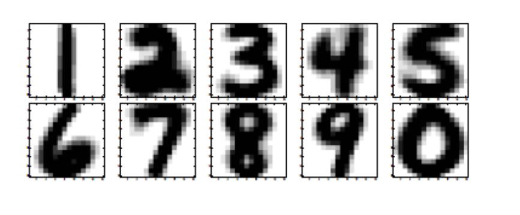

```{r setup, include=FALSE}
knitr::opts_chunk$set(echo = TRUE)
library(MASS)
library(knitr)
library(dplyr)
library(kableExtra)
```

At this assignment, we want to use SVD for pattern recognition.




### Reading data from csv file
```{r Reading files, warning=FALSE}

# Reading from csv file of trainInput to a dataframe and then conversion to matrix for transposing
trainInput.df=read.csv("trainInput.csv",header=FALSE)
trainInput=t(as.matrix(sapply(trainInput.df, as.numeric))) 

# Reading from csv file of trainOutput to a dataframe and then conversion to matrix
trainOutput.df=read.csv("trainOutput.csv",header=FALSE)
trainOutput=as.matrix(sapply(trainOutput.df, as.numeric))

# Reading from csv file of testInput to a dataframe and then conversion to matrix for transposing
testInput.df=read.csv("testInput.csv",header=FALSE)
testInput=t(as.matrix(sapply(testInput.df, as.numeric))) 

# Reading from csv file of testOutput to a dataframe and then conversion to matrix
testOutput.df=read.csv("testOutput.csv",header=FALSE)
testOutput=as.matrix(sapply(testOutput.df, as.numeric)) 

```

### Preparing matrices for each digit from training and testing datasets

```{r train digit_Matrix extraction, warning=FALSE}
#Extracting of any row in trainInput matrix that it's corresponding row in trainOutput matrix equals with desired digit, making matrices from them and finally preparing a list of these 10 matrices as A
n=1:10      #n is an index that is digit+1
A=lapply(n,function(n) trainInput[trainOutput[,1]== n-1,])

#Extracting of any row in testInput matrix that it's corresponding row in testOutput matrix equals with desired digit, making matrices from them and finally preparing a list of these 10 matrices as B
B=lapply(n,function(n) testInput[testOutput[,1]== n-1,])
```


### SVD decomposition of matrices for digits

``` {r SVD decomposition, warning=FALSE}
# SVD for A matrix of each digit and calculation of first 20 right singular vectors as singular images

OCCR_Percentage <- function(number.of.singular.images){
  #We would make a 3D array that consists 10 matrices that each matrix is first desired number of singular images    of each digit                                                      
  V=array(c(rep(0,256*number.of.singular.images*10)),dim=c(256,number.of.singular.images,10)) 
  #First we find Singular Value Decomposition of A matrix of each digit and then will consider first 20 right    singular vectors as an orthonormal basis for row of A that are training Inputs
  V[,,n]=sapply(n,function(n) svd(A[[n]])$v[1:256,1:number.of.singular.images])
  #Definition of Confusion Matrix
  Confusion.Matrix=matrix(rep(0,100),nrow=10)
  #Iterating on 10 test datsets of 10 digits
  for (digit in 0:9){                                   
    #Iterating on test sets of desired digit
    for (index in 1:nrow(B[[digit+1]])) {               
       #Conversion of row of test dataset of desired digit to a matrix
       b=matrix(B[[digit+1]][index,1:256],nrow=256)
        #Vector of distances between test dataset and span of singular images of each digit
       er=vector() 
       #Calculation of distances of each testset to 10 spans
       er=lapply(n,function(n) norm(b-V[1:256,1:number.of.singular.images,n]%*%ginv(V[1:256,1:number.of.singular.images,n])%*%b,'2'))
       #Updating Confusion Matrix
       Confusion.Matrix[digit+1,which.min(er)]= Confusion.Matrix[digit+1,which.min(er)]+1
    }
  }
  
  #finding true classifications for each digit and total true classifications
  true.classifications= apply(Confusion.Matrix,1,max)
  total.true.classifications=sum(true.classifications)
  
  #finding false classifications for each digit and total false classifications
  false.classifications= apply(Confusion.Matrix,1,sum)-true.classifications
  total.false.classifications=sum(false.classifications)
  
  #finding correct classification percentage for each digit and total correct classification percentage
  correct.classification.rate=100*true.classifications/(true.classifications+false.classifications)
  total.correct.classification.rate=  100*total.true.classifications/(total.true.classifications+total.false.classifications)
  
  #Column binding of above results with Confusion Matrix
  Confusion.Matrix=cbind(Confusion.Matrix , true.classifications,false.classifications,correct.classification.rate)
  
  #Conversion of Confusion Matrix to a dataframe for easy manipulation and printing
  Confusion.df=data.frame(Confusion.Matrix)
  #Addition of a Total row to Confusion dataframe
  total=list('_','_','_','_','_','_','_','_','_','_',total.true.classifications,total.false.classifications,total.correct.classification.rate)
  Confusion.df[11,]=total
  
  #Setting of row names and column names
  colnames(Confusion.df)=c('"0"','"1"','"2"','"3"','"4"','"5"','"6"','"7"','"8"','"9"',"True      Classifications","False Classifications","Classification Rate %")
  rownames(Confusion.df)=c('"0"','"1"','"2"','"3"','"4"','"5"','"6"','"7"','"8"','"9"','Total')
  
  #Returning Confusion dataframe
  return(Confusion.df)
}
```

### Calculation based on 20 singular images

```{r 20 singular images,warning=FALSE}
#Running function for 20 singular images
result=OCCR_Percentage(50)

#Table Printing
result %>% 
  kable(digits=2,format="html") %>%
  kable_styling() %>%
  column_spec(1, bold=T) %>%
  column_spec(14, bold=T,color='blue') %>%
  row_spec(11,bold=T,color = 'red')
  
cat("Overall correct classification rate is:",round(result[11,13],2),"%")
```

### Evaluation of overall classification rate for different numbers of singular images
``` {r evaluation, warning=FALSE}  
num.singular.images=1:2
num.OCCR=lapply(lapply(num.singular.images,OCCR_Percentage),function(x) x[11,13])
plot(num.singular.images,num.OCCR,type='p',xlab="Number of Singular Images",ylab="Perecentage of Correct Classifications")
  
```


